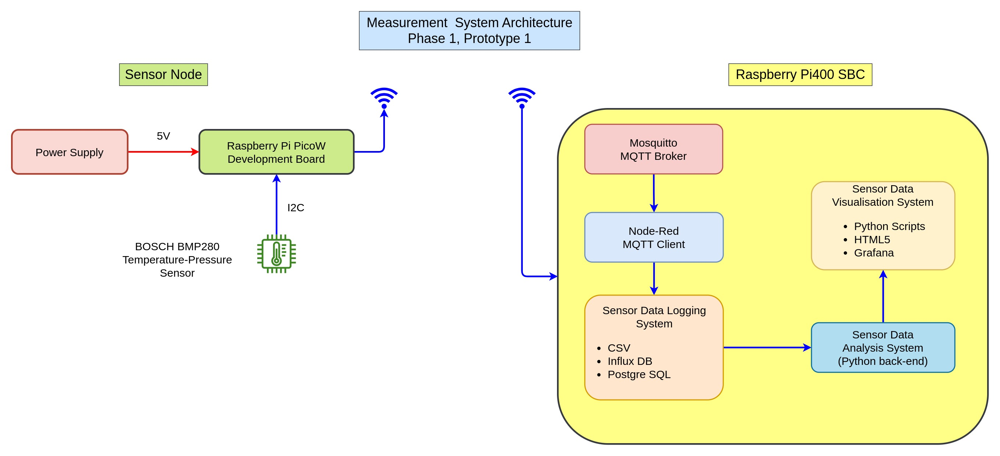

# Measurement Systems

Repository for wireless sensor data measurement system. 

## Measurement System Phase I

### Measurement System | Phase 1 | Prototype - 1 | System Architechture

### Project Description

- Goal: Implementation of a standalone wireless sensor data measurement system. Measurement system will do FSA and HHT + HSA  and other time series analysis on raspberry Pi for processing real time sensor data (Updating graphs every 1-5 minutes). 

- For first phase of the measurement system, a temperature-pressure sensor (Bosch BMP280) with a rpi PicoW board will be used for wirelessly transmitting data to a server (using MQTT/HTTP).
- Initial data logging system will be based on CSV files, later logging systems will move from CSV to SQL/Time Series DB (Postgre SQL / Influx DB)
- Backend logic for FSA, HSA and other Time-series data analysis functions will be implemented in Python.
- Initial data manipulation and visualization will be done using Python and Jupyter Notebooks
- GUI implementation will be done on rpi for interaction with the measurement system (HTML5 based) in the later prototypes 2,3 ....
- Experiments with system architechture will be done by trying and changing communication protocols- (MQTT, HTTP Restful APIs), sensor data logging system (CSV, PostgreSQL, InfluxDB), Data Visualization System (Jupyter notebooks, PowerBI, HTML GUI based pages)

  System Architechture

#### Measurement System Phase II

- Implementation of the measurement system backend logic (With reduced functionalities) on $10 Microcontroller like ESP32 / RP PicoW in MicroPython/Arduino framework. (Edge Computing)
- Running the board on battery source and visualization of results via Mobile device using a Wifi Connection

#### Measurement System Phase III

- Building a custom PCB for sensor data acquisition, logging, computing algorithms, and visualization of sensor data using Mobile device with WiFi connection.
- Cyber Security -- Password protection, Hardware encryption
- Upload of data to the cloud account/remote server.

#### Hardware specifications for custom:

  Prtotype I

  - PCB with ESP32/RP2040 | (Wroom/Wrover module), ESP32S series, PicoW board
  - UART-USB bridge | (CP2102)
  - Inbuilt accelerometer/IMU unit | (SPI/I2C)
  - Inbuilt temperature, humidity, pressure sensor | (Bosch BME280, BMP280 series)
  - Inbuilt LDR
  - Inbuilt Flash storage + removable memory card | (SPI)
  - Option for programming via SWD and USB | (USB to UART bridge) | CP2102
  - Power supply via USB and 3.3V cheap Li-ion battery.
  - Charging circuit for Li-ion battery
  - Programming via USB

#### Functional Software specifications and requirements

### Algorithm and analysis

- In depth study of the variants of EMD/HHT
- In depth study of time and memory complexity of HHT and its variants
- Implementation of advance variants of HHT/EMD/HSA algorithms in a) Python b) C++
- First sandbox to be in Jupyter Notebooks --> Python Modules
- Developing Python libraries for implementation of HHT and its variants  -- EEMD, MEMD, HHSA

